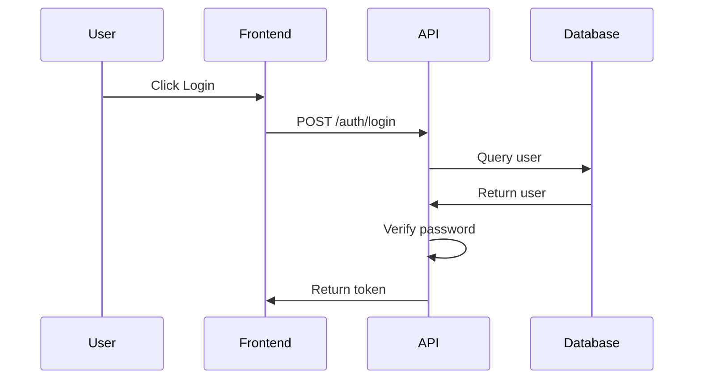

# Managing Diagrams in Specifications

Guide for creating, versioning, and syncing diagrams with your specifications.

## Overview

Diagrams communicate architecture, data models, and workflows.

## Diagram Types

| Type | Best Tool | Use Case |
|------|-----------|----------|
| **Architecture** | Draw.io | System components & interactions |
| **Data Model** | Draw.io | Database schemas |
| **Workflow** | Mermaid | Process flows |
| **Sequence** | Mermaid | Interaction sequences |

## Option 1: Mermaid (Text-Based)

### Advantages

- Version controlled as text
- GitHub renders natively
- No tool required
- Easy to diff

### Example

Create `specs/001-example/diagrams/auth-flow.mmd`:



## Option 2: Draw.io (Visual)

### Setup

1. Create diagram in [Draw.io](https://app.diagrams.net/)
2. Export as `.drawio` (editable source)
3. Export as `.png` (for preview in GitHub)

### Directory Structure

```text
specs/001-example/diagrams/
├── architecture.drawio
├── architecture.drawio.png
└── auth-flow.mmd
```

### Embed in Specification

```markdown
## Architecture


[Edit in Draw.io](https://app.diagrams.net/?url=...)
```

## Option 3: Miro (Collaborative)

Create shared Miro board for real-time collaboration, then export final diagrams to repo.

## Best Practices

1. **Keep simple** - One concept per diagram
2. **Version with specs** - Store in `specs/NNN-feature/diagrams/`
3. **Multiple formats** - Maintain source + PNG for viewing
4. **Link to source** - Include edit links back to tools
5. **Update with changes** - Refresh diagrams when spec evolves

## Recommended Setup

**Start with:** Mermaid for text diagrams (easy to version control)
**Add:** Draw.io for complex architecture (visual + editable)
**Use:** Miro for real-time collaboration, export to repo
